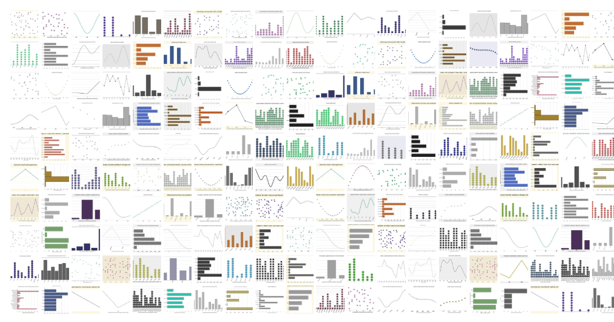

## GenPlot

This repository contains code for [GenPlot: Increasing the Scale and Diversity of Chart Derendering
Data]().

<h1 align="center">

</h1>

## Getting Started

1. Clone the repository

```
git clone https://github.com/brendanartley/GenPlot.git
```

2. Navigate to repository

```
cd GenPlot
```

3. Create a virtual environment

```
python -m venv venv
```

4. Activate the virtual environment

```
source venv/bin/activate
```

5. Install the required packages

```
pip install -r requirements.txt
```

## Plot Generation

There are a number of command line arguments that can be use to customize the generation process. These are shown below, or simply run `python generate.py -h` to view them in the command line.
```
options:
  -h, --help            show this help message and exit
  --out_file OUT_FILE   Directory to save charts in. (default: ./graphs)
  --generate_n_imgs GENERATE_N_IMGS
                        Number of charts to generate. (default: 100000)
  --seed SEED           Seed used to generate data. (default: 9090)
  --ctype CTYPE         Flag to determine which graph to generate. (v, h, l, s, d) (default: v)
```

Here are some sample commands which can be used to generate 100,000 plots of each type. 

```
python .\generate.py --generate_n_imgs=100_000 --ctype="v" --seed=9090 --out_file="./graphs_v"
python .\generate.py --generate_n_imgs=100_000 --ctype="h" --seed=9090 --out_file="./graphs_h"
python .\generate.py --generate_n_imgs=100_000 --ctype="l" --seed=9090 --out_file="./graphs_l"
python .\generate.py --generate_n_imgs=100_000 --ctype="s" --seed=9090 --out_file="./graphs_s"
python .\generate.py --generate_n_imgs=100_000 --ctype="d" --seed=9090 --out_file="./graphs_d"
```
